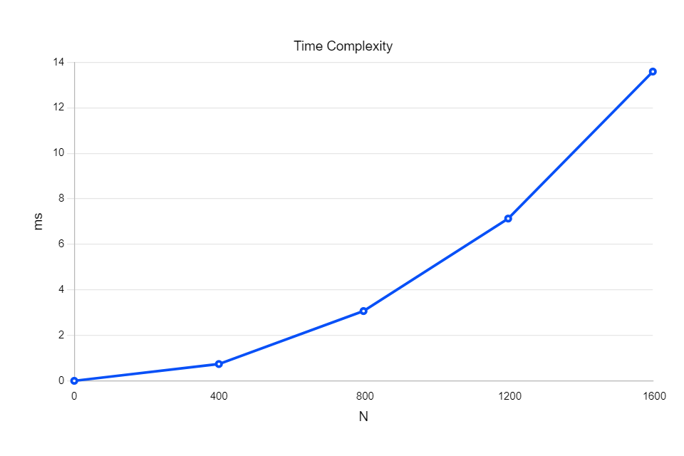
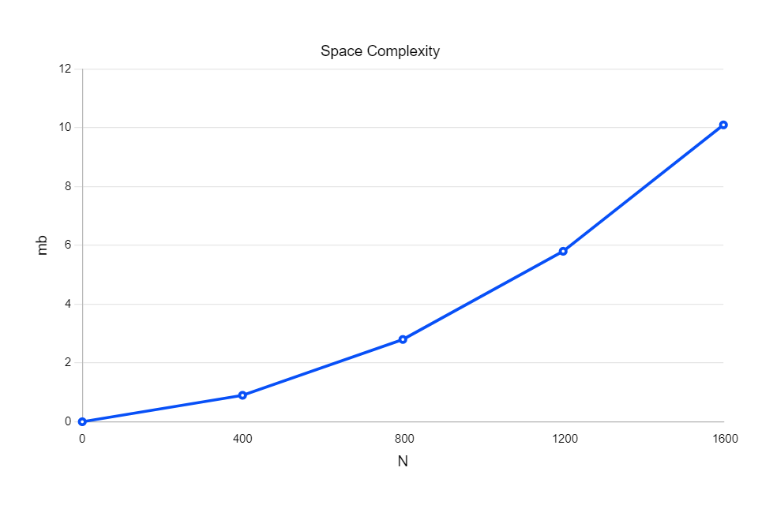

# Matrix-Vector Multiplication

## Testing the code

How to run the test:
```
make; ./main.out
```

The output:
```
Test 1:
Actual V[0] = 0 ; Expected V[0] = 0 
Actual V[1] = 0 ; Expected V[1] = 0 

Test 2:
Actual V[0] = 10; Expected V[0] = 10
Actual V[1] = 7 ; Expected V[1] = 7 

Test 3:
Actual V[0] = 5 ; Expected V[0] = 5 
Actual V[1] = 12; Expected V[1] = 12
```
The code is used to test out the function `multiply_vector_matrix()` that takes `Matrix, Vector, N, vector_expected` as its inputs. The output that came out generated by `multiply_vector_matrix()` function matches with the expected result (which was calculated manually). Therefore, the the function works properly.

## Benchmark

### Time Complexity

How to run the program:
```
make time; ./main_b_time.out
```

Output: 

```
Time elapsed: 210.596024 ms
```
In this case, the amount of time needed to calculate the multiplication of $N\times N$ Matrix to the $\mathbf{N}$-Vector having the size of `N = 10000` is `210.596024 ms`.

Below is the graph showing the amount of time needed (in milliseconds) as the size of the matrix (N) goes higher.



### Space Complexity

How to run the program :
```
make space; ./main_b_space.out
```

Output:

I used four N respectively, `N = 400`, `N = 800`, `N = 1200`, `N = 1600`. It can be seen from the image that as the size of the matrix (N) goes higher, the required amount of space will be larger.

Below is the graph showing the amount of memory needed (in megabytes) as the size of the matrix (N) goes higher.


